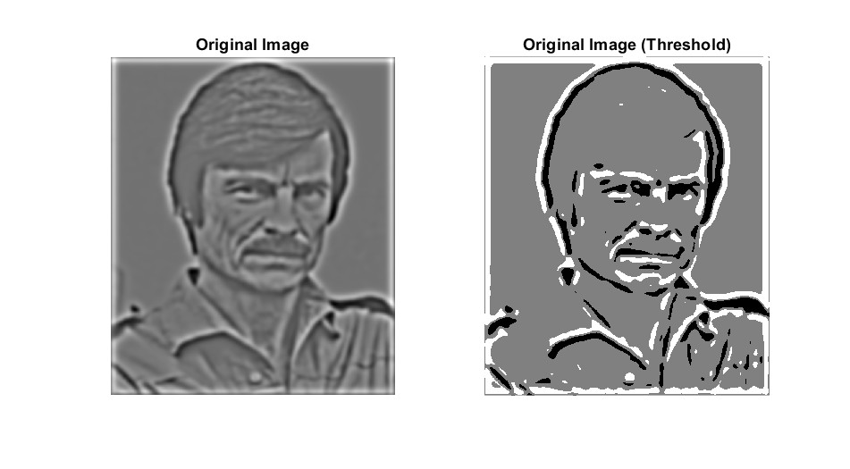
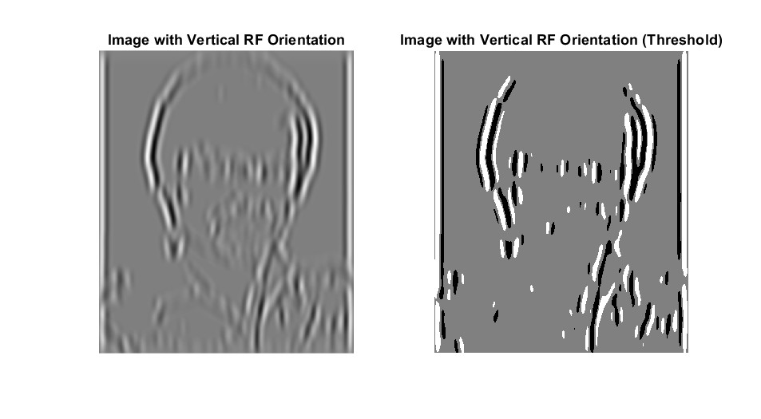
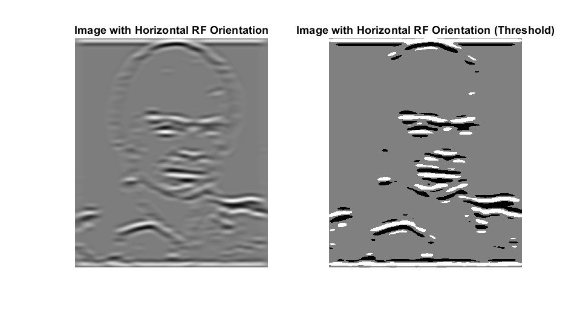
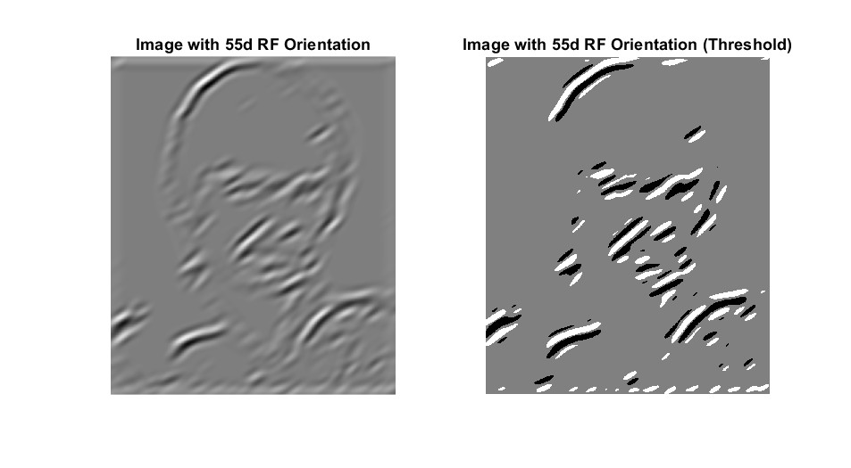
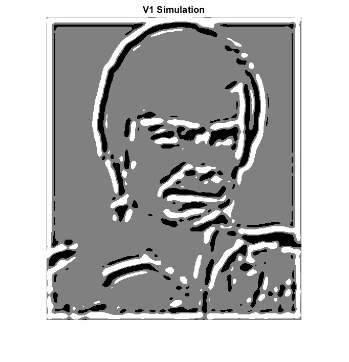

# :eyes: Simulating Human Vision with MATLAB

:white_check_mark: Project from an undergraduate course, **"Information Processing Theory"** (COG4101.01-00) at Yonsei university

:calendar: **Fall, 2022**

## Purpose of this Project
This project shows how raw image information is processed, starting from the level of **pupil** to **V1 area**. 

## Theoretical Background

||
|:-:|
|**Fig 1. Overall Pathways to V1** (Wandell, 1995)|

### :one: World to Retina
Light from the source (sun, light bulb etc...) hits an object and then bounces off. That precise moment is when the light contains the information of the object. Depending on the substance and surface of the object, some range of the light does not bounce off. The bounced light reaches our pupil and that is when our vision system start its process.

||
|:-:|
|**Fig 2. Retinal Image Formation** (Wandell, 1995)|

Some might say, how come the pupil is the start of the process of the visual system. It is because the biological lens of the pupil modifies the input light. As you can see in Fig 1, the characteristic of the pupil as biological lens causes the input light to have inconsistent density. The input light creates a linespread function when it reaches retina. G. Westheimer (1986) estimated the linespread function as following when pupil diameter is nearly 3mm. 

$$ l_{i} = 0.47e^{-3.3i^2} + 0.53e^{-0.93|i|} $$

When light enters our retina system, it follows the path as follows. 

**Light - Ganglion Cell - Bipolar Cell/Horizontal Cell - Photoreceptor(Cone/Rod)**

The body of ganglion cell is located in Ganglionic layer and makes connection with bipolor cell and horizontal cell in Inner plexiform layer. The body of bipolar cell and horizontal cell is located in Inner nuclear layer and makes connection with the photoreceptors in Outer plexiform layer. The body of photoreceptor is located in Outer nuclear layer. 

||
|:-:|
|**Fig 3. Structure of Retina** (Wandell, 1995)|

You can classify Retinal Ganglion Cell (RGC) in to five types based on its functions and connection: 

* Midget Cell (Parvocellular, or P Cells)
* Parasol Cell (Magnocellular, or M Cells)
* Bistratisfied Cell (Koniocellular or K pathway)
* Photosensitive Ganglion Cells
* Other cells connected to superior colliculus
 

### :two: Retina to LGN 
RGC projects to a specific area in thalamus, which is called Lateral Geniculate Nucleus (LGN). There are two LGN in each Right/Left thalamus. LGN has 6 layers of neurons and it can be classified in to 2 layers(Magnocellular layer, Parvocellular layer) based on the connection with RGC. M Cells projects to layer 3,4,5, and 6 which are classified as Magnocellular layer. P Cells projects to layer 1 and 2 which are classified as Parvocellular layer. 

||
|:-:|
|**Fig 4. Structure of LGN** (Wandell, 1995)|

M cells are more sensitive to low spatial & high temporal frequencies and P Cells are more sentitive to high spatial & low temporal frequencies. Therefore, Magnocellular layers recieves information related to motion, depth and small differences in brightness. In the other hand, Parvocellular layers recieves information related to color and detailed form. 

There is also Koniocellular layer, which is projected by Koniocellular cells. This layer is located between Magnocellular layers and Parvocellular layers. Research aboout this layer and K cells are ongoing.

### :three: LGN to V1
Signal starting from Retina reaches to Primary Visual Cortex(V1) via LGN. There are six layers(1-6). Signals from LGN is projected to layer 4, specifically layer 4C. Magnocellular layers are connected to V1 layer 4c&#945; and Parvocellular layers are connected to V1 layer 4c&#946;. 4B recieves information from 4C and then sends it to other cortical areas. Koniocellular layers are connected to V1 layer 2 and 3. V1 layer 6 sends feedback to LGN. 

||
|:-:|
|**Fig 5. Layers of V1** (Wandell, 1995)|

### :four: Receptive fields in V1

According to the studies by Hubel and Wiesel, there are two types of cortical neuron based on its linearity. The one with linearity is called Simple Cell, the other one is called Complex Cell. These two cells also shows different results on contrast sensitivity. DeValois, Albrecht and Thorell measured the neural response of a contrast reversing stimulus with temporal period of 5 seconds. The result was as follows: Simple cell showed a half-rectified sinusodial wave, which it's frequency matches with the stimulus's frequency. In the other hand, Complex cell showed a full-rectified sinusodial wave, which it's frequency did not matches with the input stimulus's frequency. 

||
|:-:|
|**Fig 6. Contrast Sensitivity of (a) Simple / (b) Complex Cell** (DeValois, Albrecht, Thorell, 1982)|

Hubel and Wiesel discovered two distinct properties of cortical neurons apart from retinal neurons or LGN neurons: **Orientation Selectivity** and **Direction Selectivity**

### Orientation Selectivity

Cortical neurons shows more response in certain orientation of stimulus. Orientation selective neurons are found throughout layer 2 and 3. Study shows in any small region in layer 2 and 3, the perferred orientation of collection of neurons is similar. Obermayer and Blasdel (1993) visualized regions with common orientation preference which is shown as gray lines in Fig 7. The lines are called iso-oriention lines or orientation colummn. These lines are nearly perpendicular to ocular dominance column. Iso-orientation lines toward a single point located in the middle of ocular dominance columns, which is called 'Singularity'. 

||
|:-:|
|**Fig 7. Orientation Columns and Ocular Dominance Columns** Obermayer and Blasdel (1993)|

Orientation Selectivity of a Simple Cell can be simulated by using its linearity. If circular symmetric receptive fields in LGN neurons constructs a certain form, by superposition which is also a key property of linearity, it can create an orientation sensitive receptive fields in V1. Therefore, simple summation model can explain how simple cells in V1 can obtain orientation sensitivity from non-oriented LGN receptive fields. However, this model cannot be applied to Complex Cells because complex cells are not linear. Complex cells need more complicated models.

### Direction Selectivity

The second property of receptive fields in V1 is 'Direction Selectivity'. Certain cortical neurons shows strong response toward a certain direction of stimulus's motion and shows weak response toward the opposite direction of the same stimulus. 

||
|:-:|
|**Fig 8. Direction selectivity of a cortical neuron’s response** (Hubel and Wiesel, 1968)|

The direction sensitive neurons are found in layer 4A, 4B, 4C&#945; and 6. The interesting part is that these layers recieves information from Magnocellular layers in LGN which handles information related to motion. Therefore, these neurons maybe a part of a visual stream that is carries information of motion. 

:page_facing_up: **Reference** 
* Lecture notes from [prof. Sang Chul Chong](https://vcc.yonsei.ac.kr/pi) (Dept. Psychology, Yonsei univ.) 
* Wandell, B. A. (1995). [Foundations of Vision Science: Behavior, neuroscience, and computation](http://foundationsofvision.stanford.edu/). Sinauer Associates. 

## Result of the Project

||
|:-:|
|**Fig 9. Original Sample Image** (Andrei Tarkovsky)|

||
|:-:|
|**Fig 10. Vertical Receptive Field Orientation**|

||
|:-:|
|**Fig 11. Horizontal Receptive Field Orientation**|

||
|:-:|
|**Fig 12. 55 degree Receptive Field Orientation**|

||
|:-:|
|**Fig 13. V1 Simulation**|

